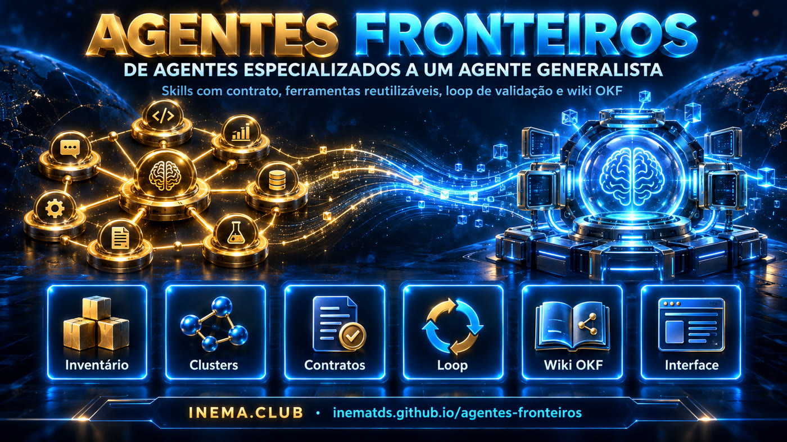

# agentes-fronteiros

**🇧🇷 [Português](README.md) · 🇺🇸 [English](README.en.md) · 🇪🇸 [Español](README.es.md)**

[](https://inematds.github.io/agentes-fronteiros/guia/es/)

## 📖 Guía de uso

Guía completa (landing + paso a paso): **https://inematds.github.io/agentes-fronteiros/guia/es/**

Proyecto de **migración** del ecosistema INEMA de agentes especializados hacia
**un agente generalista + skills con contrato + herramientas reutilizables +
bucle de validación + base de conocimiento viva**.

Tres referencias combinadas:

| Referencia | Qué incluye |
|---|---|
| **Plan de migración** (`PLANO.md`) | Las 10 etapas: inventario → agente base → skills → tools → progressive disclosure → aprendizaje → bucle → contrato → router → sistema vivo. |
| **eve (Vercel)** — modelo de carpetas | El agente es un directorio: `agent/instructions.md`, `skills/`, `tools/`, `connections/`, `channels/`, `schedules/`, `subagents/`, `hooks/`, `lib/`, `sandbox/` y `evals/` al mismo nivel. Aquí es una **convención de carpetas**, no el runtime de TypeScript. |
| **OKF + LLM wiki (Karpathy)** | La base de conocimiento en `wiki/` es un paquete OKF: Markdown + YAML frontmatter (`type` obligatorio, `sources`, `generated`, `verified`, `status`, `stale_after`), `index.md` y `log.md` reservados. El agente mantiene la wiki: incorpora fuentes sin procesar de `wiki/raw/`, las consolida en conceptos y actualiza el índice y el registro. |

## Estructura

```text
agentes-fronteiros/
├── README.md · PLANO.md · ARQUITETURA.md · CLAUDE.md · FALHAS.md
├── agent/                 # estructura eve (convención)
│   ├── agent.yaml         # modelo, esfuerzo, política de enrutamiento
│   ├── instructions.md    # prompt siempre activo del agente generalista (INEMA AGENT)
│   ├── skills/            # skills migradas (SKILL.md + references/ + scripts/ + contrato.yaml)
│   ├── tools/             # herramientas reutilizables (ffmpeg, transcripción, renderizado, validación)
│   ├── connections/ channels/ schedules/ subagents/ hooks/ lib/ sandbox/
├── evals/                 # tareas reales usadas para aprobar cada skill migrada
├── wiki/                  # paquete OKF (base de conocimiento)
│   ├── SCHEMA.md          # convenciones de la wiki (el «schema» de LLM wiki)
│   ├── index.md · log.md  # reservados (listado + historial)
│   ├── raw/               # fuentes sin procesar incorporadas (nunca se editan)
│   ├── conceitos/         # conceptos seleccionados (okf, eve, llm-wiki, contrato-de-skill, loop...)
│   ├── skills/            # 1 concepto por skill existente (generado por tools/inventario.py)
│   ├── agentes/           # 1 concepto por agente existente
│   └── clusters/          # superposiciones detectadas (varias skills, misma intención)
├── migracao/
│   ├── template-contrato.yaml · template-SKILL.md
│   └── contratos/         # reels.yaml · video-explicativo.yaml · curso.yaml (pilotos)
├── tools/
│   ├── inventario.py      # recorre ~/.claude/skills y ~/.claude/agents → wiki/skills, wiki/agentes, wiki/clusters, index
│   └── wiki_lint.py       # valida el frontmatter OKF (falla si falta `type`), los enlaces y los reservados
└── interface/
    ├── server.py          # servidor local (stdlib) — API sobre la wiki
    └── index.html         # interfaz de migración (kanban por etapa, clusters, contratos, wiki)
```

## Instalación

Requisitos: **Python 3.11+** y **PyYAML**. No requiere compilación, base de datos ni framework.

```bash
git clone https://github.com/inematds/agentes-fronteiros
cd agentes-fronteiros

# PyYAML (único paquete fuera de la biblioteca estándar)
pip install pyyaml            # ou: sudo apt install python3-yaml

# verificar
python3 -c "import yaml; print('ok', yaml.__version__)"
```

El inventario lee las skills y los agentes instalados en Claude Code en tu máquina:
`~/.claude/skills/*/SKILL.md` y `~/.claude/agents/*.md`. Si están en otro lugar,
pasa `--skills DIR --agents DIR` a `inventario.py`.

## Cómo usar

### 1. Generar el inventario (etapa 1 del plan)

```bash
python3 tools/inventario.py
# skills: 116 (sin SKILL.md: 1)  agentes: 7  clusters: 16  arquivos alterados: N
```

Escribe una página OKF por skill en `wiki/skills/`, una por agente en `wiki/agentes/` y un
cluster por grupo de skills que compiten por la misma intención en `wiki/clusters/`. Regenera los
`index.md` y registra una línea en `wiki/log.md`. Es idempotente: volver a ejecutarlo sin cambios
no modifica nada y **preserva** el campo `migracao:` y la sección «Notas de migración» de cada página.

Opciones: `--dry-run` (solo muestra), `--skills DIR`, `--agents DIR`, `--wiki DIR`.

### 2. Validar la wiki

```bash
python3 tools/wiki_lint.py
# wiki: 149 conceitos · 0 erros · 2 avisos
```

Falla (exit 1) si a un concepto le falta `type`, si `index.md`/`log.md` tienen frontmatter de
concepto, si hay un enlace relativo roto, si `related` apunta a un concepto inexistente,
o si `status` o `migracao.estagio` no están en la lista. Ejecutar antes de cada commit.

### 3. Abrir la interfaz de migración

```bash
python3 interface/server.py            # http://127.0.0.1:8765
python3 interface/server.py --port 9000 --host 0.0.0.0   # otro puerto / red local
```

Pestañas:

| Pestaña | Qué hace |
|---|---|
| **Kanban** | Skills y agentes en columnas por etapa. Haz clic en una tarjeta para abrir el panel. |
| **Tabla** | Lista filtrable (búsqueda, cluster, tipo) con activadores, herramientas mencionadas y nº de scripts. |
| **Clusters** | Grupos de superposición con barra de progreso y enlace a la página del cluster. |
| **Contratos** | Los YAML de `migracao/contratos/` (trigger, acceptance, YAML completo). |
| **Wiki** | Lector de cualquier concepto por id (p. ej., `conceitos/okf`), con enlaces navegables. |
| **Log** | El `wiki/log.md`. |
| **↻ Volver a inventariar** | Ejecuta `tools/inventario.py` y recarga. |

En el panel puedes cambiar la **etapa**, el **cluster**, el **destino** (nombre de la skill migrada) y las **notas**.
«Guardar» escribe directamente en el frontmatter de la página en `wiki/skills/<nome>.md` y agrega una
línea a `wiki/log.md`. Los chips de la parte superior filtran por etapa.

La interfaz solo funciona con el servidor local en ejecución (la API lee y escribe archivos); si se abre
como archivo estático, muestra el comando para iniciar el servidor.

API (para scripts): `GET /api/inventario`, `GET /api/clusters`, `GET /api/contratos`,
`GET /api/wiki?id=<conceito>`, `GET /api/log`, `POST /api/migracao {id, estagio, cluster,
destino, notas}`, `POST /api/rescan`.

### 4. Migrar una skill (el ciclo del plan)

Para cada skill, en el orden de las etapas del kanban:

1. **mapeado** — completar la tabla «Mapa» de la página en `wiki/skills/<nome>.md` (salida y validación) y escribir el contrato:
   ```bash
   cp migracao/template-contrato.yaml migracao/contratos/<nome>.yaml   # editar
   ```
2. **skill** — crear la skill migrada a partir de la plantilla:
   ```bash
   mkdir -p agent/skills/<nome>/references
   cp migracao/template-SKILL.md       agent/skills/<nome>/SKILL.md     # editar
   cp migracao/contratos/<nome>.yaml   agent/skills/<nome>/contrato.yaml
   ```
3. **tools** — mover el código repetido (ffmpeg, transcripción, descarga, renderizado, validación) a `agent/tools/<x>.py` (CLI con `--help`, salida JSON, exit 0/1). Ver las candidatas en la sección «Repetición detectada» de cada `wiki/clusters/<id>.md`.
4. **contrato** — `acceptance` verificable, idealmente con un `agent/tools/validate_*.py`.
5. **loop** — sección «Loop» en `SKILL.md` (planificar → ejecutar → inspeccionar → criticar → corregir → probar, límite de 3 vueltas).
6. **testado** — escribir la tarea en `evals/tarefas/<nome>-NN.md` y aprobar al menos 2.
7. **aprovado** — uso real sin correcciones. Si hubo una corrección: una línea en `FALHAS.md` + ajuste en la skill.

Marca cada paso en la interfaz (o edita `migracao.estagio` en el frontmatter). Las skills
absorbidas por otra pasan a **descontinuado**, con `destino` apuntando a la skill que permanece.

### 5. Mantener la wiki (estilo LLM wiki)

```bash
cp fonte.md wiki/raw/2026-09-20-fonte.md   # fuente sin procesar: fecha en el nombre, nunca editar
# el agente consolida en wiki/conceitos/ (sources, generated, related), regenera index.md y escribe en log.md
python3 tools/wiki_lint.py
```

Convenciones completas del frontmatter, actores y operaciones en `wiki/SCHEMA.md`.

### 6. Usar el agente base

`agent/instructions.md` es el prompt siempre activo del agente generalista (ciclo + router
intención → cluster → skill). Para usarlo en Claude Code, pégalo en el `CLAUDE.md` del proyecto donde
operará el agente o apunta a él; `agent/agent.yaml` guarda el modelo, la política de
enrutamiento y el límite del bucle.

## El estado de migración está en la wiki

Cada skill tiene **una página** en `wiki/skills/<nome>.md`. La etapa de migración
está en el frontmatter de esa página (campo `migracao:`), que la interfaz lee y
escribe. No existe un `state.json` paralelo: la wiki es la única fuente de verdad.

Etapas (los 9 pasos de la estrategia práctica del plan, compactados):

`inventariado → mapeado → skill → tools → contrato → loop → testado → aprovado` (o `descontinuado`)

## Pilotos

El plan indica comenzar con 3 agentes. Los contratos piloto están en `migracao/contratos/`:

- **reels** → cluster `reels` (`reel-edita-inema`, `reel-edita-inematds`, `forja-reel`, `roteirista-inema`)
- **video-explicativo** → cluster `video-explicativo` (`video-explicativo`, `videoprodutor`, `faceless-explainer`)
- **curso** → cluster `curso` (`formato-curso-v5`, `formato-curso-v2`, `revisar-curso`, `videos-cursos-inema`)

`cria-books`, citado en el plan, no existe como skill local: queda registrado como brecha.
