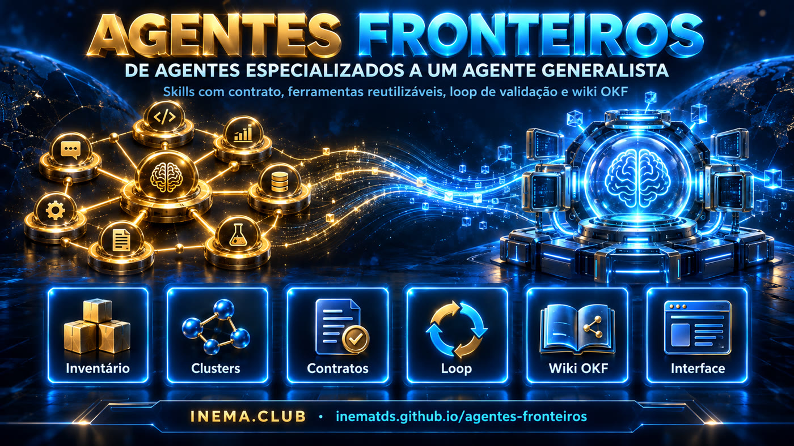

# agentes-fronteiros

[](https://inematds.github.io/agentes-fronteiros/guia/)

## 📖 Guia de uso

Guia completo (landing + passo a passo): **https://inematds.github.io/agentes-fronteiros/guia/**

Projeto de **migração** do ecossistema INEMA de agentes especializados para
**um agente generalista + skills com contrato + ferramentas reutilizáveis +
loop de validação + base de conhecimento viva**.

Três referências combinadas:

| Referência | O que entra aqui |
|---|---|
| **Plano de migração** (`PLANO.md`) | As 10 etapas: inventário → agente base → skills → tools → progressive disclosure → aprendizado → loop → contrato → router → sistema vivo. |
| **eve (Vercel)** — modelo de pastas | O agente é um diretório: `agent/instructions.md`, `skills/`, `tools/`, `connections/`, `channels/`, `schedules/`, `subagents/`, `hooks/`, `lib/`, `sandbox/` e `evals/` ao lado. Aqui é **convenção de pastas**, não o runtime TypeScript. |
| **OKF + LLM wiki (Karpathy)** | A base de conhecimento em `wiki/` é um bundle OKF: markdown + YAML frontmatter (`type` obrigatório, `sources`, `generated`, `verified`, `status`, `stale_after`), `index.md` e `log.md` reservados. O agente mantém a wiki: ingere fontes brutas de `wiki/raw/`, consolida em conceitos, atualiza índice e log. |

## Estrutura

```text
agentes-fronteiros/
├── README.md · PLANO.md · ARQUITETURA.md · CLAUDE.md · FALHAS.md
├── agent/                 # layout eve (convenção)
│   ├── agent.yaml         # modelo, esforço, política de roteamento
│   ├── instructions.md    # prompt sempre-ligado do agente generalista (INEMA AGENT)
│   ├── skills/            # skills migradas (SKILL.md + references/ + scripts/ + contrato.yaml)
│   ├── tools/             # ferramentas reutilizáveis (ffmpeg, transcrição, render, validação)
│   ├── connections/ channels/ schedules/ subagents/ hooks/ lib/ sandbox/
├── evals/                 # tarefas reais usadas para aprovar cada skill migrada
├── wiki/                  # bundle OKF (base de conhecimento)
│   ├── SCHEMA.md          # convenções da wiki (o "schema" do LLM wiki)
│   ├── index.md · log.md  # reservados (listagem + histórico)
│   ├── raw/               # fontes brutas ingeridas (nunca editadas)
│   ├── conceitos/         # conceitos curados (okf, eve, llm-wiki, contrato-de-skill, loop...)
│   ├── skills/            # 1 conceito por skill existente (gerado por tools/inventario.py)
│   ├── agentes/           # 1 conceito por agente existente
│   └── clusters/          # sobreposições detectadas (várias skills, mesma intenção)
├── migracao/
│   ├── template-contrato.yaml · template-SKILL.md
│   └── contratos/         # reels.yaml · video-explicativo.yaml · curso.yaml (pilotos)
├── tools/
│   ├── inventario.py      # varre ~/.claude/skills e ~/.claude/agents → wiki/skills, wiki/agentes, wiki/clusters, index
│   └── wiki_lint.py       # valida frontmatter OKF (falha se faltar `type`), links e reservados
└── interface/
    ├── server.py          # servidor local (stdlib) — API sobre a wiki
    └── index.html         # interface de migração (kanban por estágio, clusters, contratos, wiki)
```

## Instalação

Requisitos: **Python 3.11+** e **PyYAML**. Não há build, banco nem framework.

```bash
git clone https://github.com/inematds/agentes-fronteiros
cd agentes-fronteiros

# PyYAML (único pacote fora da biblioteca padrão)
pip install pyyaml            # ou: sudo apt install python3-yaml

# conferir
python3 -c "import yaml; print('ok', yaml.__version__)"
```

O inventário lê as skills e agentes instalados no Claude Code da sua máquina:
`~/.claude/skills/*/SKILL.md` e `~/.claude/agents/*.md`. Se estiverem em outro lugar,
passe `--skills DIR --agents DIR` para o `inventario.py`.

## Como usar

### 1. Gerar o inventário (etapa 1 do plano)

```bash
python3 tools/inventario.py
# skills: 116 (sem SKILL.md: 1)  agentes: 7  clusters: 16  arquivos alterados: N
```

Escreve uma página OKF por skill em `wiki/skills/`, por agente em `wiki/agentes/` e um
cluster por grupo de skills que disputam a mesma intenção em `wiki/clusters/`. Regenera os
`index.md` e registra uma linha em `wiki/log.md`. É idempotente: rodar de novo sem mudanças
não altera nada, e **preserva** o campo `migracao:` e a seção "Notas de migração" de cada página.

Opções: `--dry-run` (só mostra), `--skills DIR`, `--agents DIR`, `--wiki DIR`.

### 2. Validar a wiki

```bash
python3 tools/wiki_lint.py
# wiki: 149 conceitos · 0 erros · 2 avisos
```

Falha (exit 1) se um conceito não tiver `type`, se `index.md`/`log.md` tiverem frontmatter de
conceito, se houver link relativo quebrado, `related` apontando para conceito inexistente,
`status` ou `migracao.estagio` fora da lista. Rodar antes de todo commit.

### 3. Abrir a interface de migração

```bash
python3 interface/server.py            # http://127.0.0.1:8765
python3 interface/server.py --port 9000 --host 0.0.0.0   # outra porta / rede local
```

Abas:

| Aba | O que faz |
|---|---|
| **Kanban** | Skills e agentes em colunas por estágio. Clique num card para abrir a gaveta. |
| **Tabela** | Lista filtrável (busca, cluster, tipo) com gatilhos, ferramentas citadas e nº de scripts. |
| **Clusters** | Grupos de sobreposição com barra de progresso e link para a página do cluster. |
| **Contratos** | Os YAML de `migracao/contratos/` (trigger, acceptance, YAML completo). |
| **Wiki** | Leitor de qualquer conceito pelo id (ex.: `conceitos/okf`), com links navegáveis. |
| **Log** | O `wiki/log.md`. |
| **↻ Re-inventariar** | Roda `tools/inventario.py` e recarrega. |

Na gaveta você muda **estágio**, **cluster**, **destino** (nome da skill migrada) e **notas**.
"Salvar" grava direto no frontmatter da página em `wiki/skills/<nome>.md` e acrescenta uma
linha no `wiki/log.md`. Os chips do topo filtram por estágio.

A interface só funciona com o servidor local rodando (a API lê e escreve arquivos); aberta
estática, ela mostra o comando para subir o servidor.

API (para scripts): `GET /api/inventario`, `GET /api/clusters`, `GET /api/contratos`,
`GET /api/wiki?id=<conceito>`, `GET /api/log`, `POST /api/migracao {id, estagio, cluster,
destino, notas}`, `POST /api/rescan`.

### 4. Migrar uma skill (o ciclo do plano)

Para cada skill, na ordem dos estágios do kanban:

1. **mapeado** — completar a tabela "Mapa" da página em `wiki/skills/<nome>.md` (saída e validação) e escrever o contrato:
   ```bash
   cp migracao/template-contrato.yaml migracao/contratos/<nome>.yaml   # editar
   ```
2. **skill** — criar a skill migrada a partir do template:
   ```bash
   mkdir -p agent/skills/<nome>/references
   cp migracao/template-SKILL.md       agent/skills/<nome>/SKILL.md     # editar
   cp migracao/contratos/<nome>.yaml   agent/skills/<nome>/contrato.yaml
   ```
3. **tools** — mover código repetido (ffmpeg, transcrição, download, render, validação) para `agent/tools/<x>.py` (CLI com `--help`, saída JSON, exit 0/1). Ver candidatas na seção "Repetição detectada" de cada `wiki/clusters/<id>.md`.
4. **contrato** — `acceptance` verificável, idealmente com um `agent/tools/validate_*.py`.
5. **loop** — seção "Loop" no `SKILL.md` (planejar → executar → inspecionar → criticar → corrigir → testar, teto 3 voltas).
6. **testado** — escrever a tarefa em `evals/tarefas/<nome>-NN.md` e passar em pelo menos 2.
7. **aprovado** — uso real sem correção. Se houve correção: linha em `FALHAS.md` + ajuste na skill.

Marque cada passo na interface (ou edite o `migracao.estagio` no frontmatter). Skills
absorvidas por outra vão para **descontinuado** com o `destino` apontando a skill que ficou.

### 5. Manter a wiki (estilo LLM wiki)

```bash
cp fonte.md wiki/raw/2026-09-20-fonte.md   # fonte bruta: data no nome, nunca editar
# o agente consolida em wiki/conceitos/ (sources, generated, related), regenera index.md e escreve no log.md
python3 tools/wiki_lint.py
```

Convenções completas de frontmatter, atores e operações em `wiki/SCHEMA.md`.

### 6. Usar o agente base

`agent/instructions.md` é o prompt sempre-ligado do agente generalista (ciclo + router
intenção → cluster → skill). Para usar no Claude Code, cole-o no `CLAUDE.md` do projeto onde
o agente vai operar, ou aponte para ele; `agent/agent.yaml` guarda modelo, política de
roteamento e teto do loop.

## Estado de migração mora na wiki

Cada skill tem **uma página** em `wiki/skills/<nome>.md`. O estágio de migração
fica no frontmatter dessa página (campo `migracao:`), que a interface lê e
escreve. Não existe um `state.json` paralelo: a wiki é a única fonte de verdade.

Estágios (os 9 passos da estratégia prática do plano, compactados):

`inventariado → mapeado → skill → tools → contrato → loop → testado → aprovado` (ou `descontinuado`)

## Pilotos

O plano manda começar por 3 agentes. Os contratos-piloto estão em `migracao/contratos/`:

- **reels** → cluster `reels` (`reel-edita-inema`, `reel-edita-inematds`, `forja-reel`, `roteirista-inema`)
- **video-explicativo** → cluster `video-explicativo` (`video-explicativo`, `videoprodutor`, `faceless-explainer`)
- **curso** → cluster `curso` (`formato-curso-v5`, `formato-curso-v2`, `revisar-curso`, `videos-cursos-inema`)

`cria-books`, citado no plano, não existe como skill local: fica registrado como lacuna.
